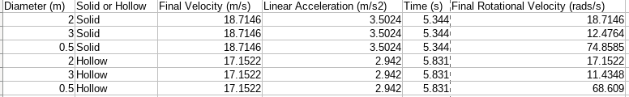

# Moment of Inertia Lab Report

__Harsh Parekh__

## Introduction
We perform an experiment to see how mass distribution affects the motion of an object that performs translational as well as rotational motion.

## Methods
__Materials:__

1. A ramp.
2. Disks of varying diameters.
2. Rings of varying diameters.

__Setup:__

1. Place the object (Disk or Ring) at the top of the ramp.
2. Note the diameter of the object.
3. Let the object roll down the ramp and note the following:
    + Time taken to reach the bottom of the ramp.
    + Final translational and rotational velocity.
    + Linear acceleration.

__Data:__

## Discussion of results
We see that the mass distribution of an object affects its motion. 
In particular we see that it affects the time taken to reach the bottom and the angular velocity of the object. Furethermore, we also see that for a given geometry (Disk or Ring) the translational properties such as translational velocity and translational acceleration stays the same.

## Conclusion
The experimeent was successful in demonstrating how mass distribution affects the motion of a rolling object.
