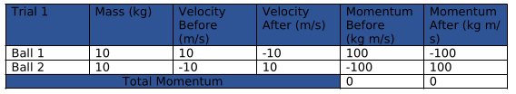
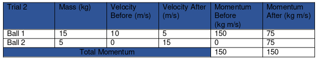
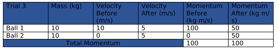
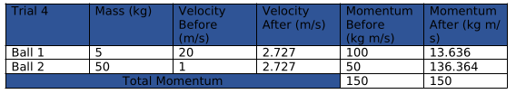
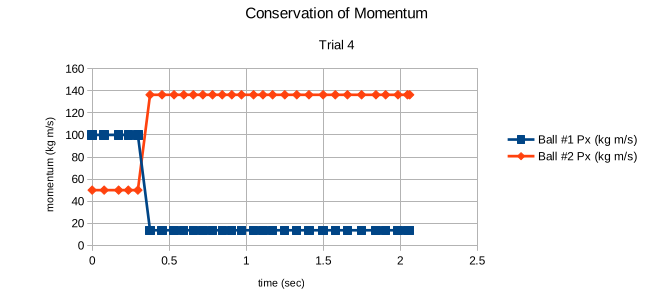

# Conservation of Momentum Lab Report

__Harsh Parekh__

## Introduction
We perform an experiment to verify that the net momentum of a system is conserved under collision.
$$
    \sum_i p_i = const 
$$

In this experiment we have two balls collide under various scenarios and then compare the initial and final momentum of the system.

## Methods
__Materials:__

1. Balls of various masses.
2. A frictionless table.

__Setup:__

1. Setup the balls on table.
2. Impart some velocity on each of the balls and calculate their momentum.
3. After the balls collide measure ttheir final velocity and momentum.
4. Repeat the experiment with diferent set of masses and velocities.

## Data Analysis

## Discussion of results
Each trial in te experiment strongly suggests that the momentum of a system of bodies is conserved when no external forces act on it.
We see that as the momentum of one ball decreases, the momewntum of the other ball increases by the same amount, conserving the total momentum of the system.

## Conclusion
The experiment has successfully demonstrated that under various conditions the total momentum of a system is conserved.

